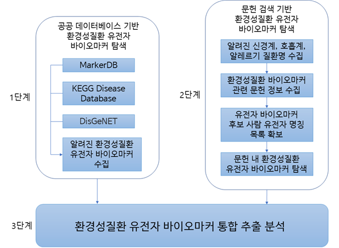

# 환경성질환 유전자 바이오마커 데이터베이스

## 목차

[1. 연구 배경 및 목적](#content1)

[2. 환경성질환 유전자 바이오마커 수집 전략 및 과정 모식도](#content2)

[3. 알려진 신경계, 호흡계, 알레르기 질환 유전자 바이오마커 정보 수집 결과](#content3)

[3.1 1단계: 공개된 데이터베이스 내 환경성질환 유전자 바이오마커 수집](#content3.1)

## 1. 연구 배경 및 목적 

1. 급격한 산업화에 의하여 배출되는 오염물질의 종류가 상승중
2. 미세먼지, 유해화학물질 등 다양한 환경유해인자 노출로 인한 환경성질환 발생이 지속적으로 증가
3. 따라서 환경유해인자와 환경성질환 간 상관성을 예측하고 평가하기 위한 기술이 필요
----

* 6대 환경성질환군: 호흡계/순환계/알레르기/신경계/임신출산계/감각계 질환
* 환경부령 환경보건법 상에서 공통적으로 환경성질환으로 제시된 신경계/호흡계/알레르기 질환군 3개를 연구 대상으로 설정
* 알려진 신경계, 호흡계, 알레르기 질환에 대한 유전자 바이오마커 정보 수집

## 2. 환경성질환 유전자 바이오마커 수집 전략 및 과정 모식도 

## 3. 알려진 신경계, 호흡계, 알레르기 질환 유전자 바이오마커 정보 수집 결과 

### 3.1 1단계: 공개된 데이터베이스 내 환경성질환 유전자 바이오마커 수집 

* 잘 알려진 인간 질병 바이오마커 데이터베이스 6종 중 MarkerDB, KEGG Disease Database, DisGeNET 3종을 선정
* 데이터베이스 3종 선정 기준: 라이센스 필요(GOBIOM), 환경성질환 유전자 바이오마커 정보 미포함(IDBD, ResMarkerDB) 데이터베이스는 제외

데이터베이스 | 주요 대상 질병군 | 업데이트 현황 | 웹 주소
---- | ---- | ---- | ----
MarkerDB | 알려진 임상 분자 바이오마커 | 2021년 1월 | https://markerdb.ca
KEGG Disease Database | 질병 유전자/환경 바이오마커 | 2021년 5월 | https://www.genome.jp/kegg/disease
DisGeNET | 질병 관련 유전자, 변이 바이오마커 | 2021년 10월 | https://www.disgenet.org
GOBIOM | 단백질, 유전자 등 바이오마커 | 2022년 2월 | https://gobiomdbplus.com
IDBD | 감염성 질병 관련 바이오마커 | 2008년 1월 | http://biomarker.cdc.go.kr
ResMarkerDB | 유방/대장암 관련 항체 바이오마커 | 2019년 3월 | http://www.resmarkerdb.org

#### MarkerDB

데이터베이스 특징 및 속성
* 임상적으로 알려지거나 일부 pre-clinical 단계 분자 바이오마커 데이터베이스
* 화학물질, 단백질, 유전자, 핵형(karyotype) 4종류로 바이오마커를 분류

MarkerDB에서 아래 분류에 해당하는 질병의 유전자 바이오마커를 수집함
* Nervous System Disorder
* Respiratory System Disorder

#### KEGG Disease Database
#### DisGeNET
